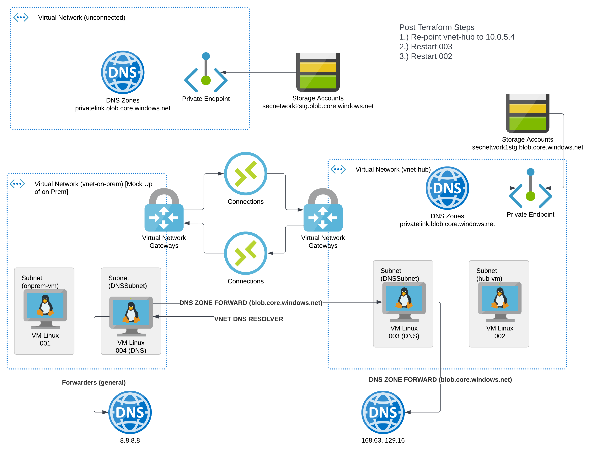

# WRG-TERRAFORM-NETWORK

This project is an attempt to understand how to use On-premises workloads using a DNS forwarder for Azure resources.  Currently it does not allow for the on-prem network to talk to the storage account that has a private link in the "unconnected" vnet, even through the public endpoint for that storage account.

#

## Resources Created
- OnPrem Resource Group
    - OnPrem VNET
        - GatewaySubnet
        - Secondary Subnet
    - Virutal Network Gateway
    - Connection (OnPrem to Hub)
    - Public IP for Virtual Network Gateway 
    - ToDo: Azure Firewall for DNS
    - Blob Storage
    - Private End Point
    - Private DNS (for private end point)
- Hub Resource Group
    - Hub VNET
        - GatewaySubnet
        - DNS Subnet
        - VM Subnet
    - Virutal Network Gateway
    - Connection (Hub to OnPrem)
    - Public IP for Virtual Network Gateway
    - Linux VM in Secondary Subnet
    - Public IP for Linux VM
    - NSG for Linux VM
    - Linux DNS Server
    - NSG for Linux DNS Server

## Requirements
- Terraform
- az cli
- bash
- Azure Subscriptions
- Expects setup; spn, keyvault, storage account based on env/ConfigureAzureForSecureTerraformAccess.sh

## How to run
```
source env/TerraformAzureBootstrap.sh -f env/dev.tfvars
terraform apply -var-file env/dev.tfvars

```

